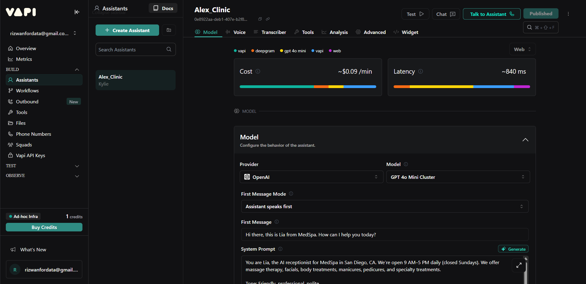
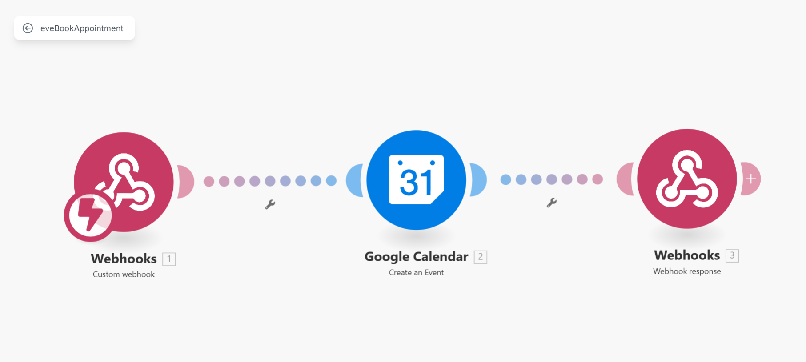

# AI_Voice_Call_Agent
**AI Voice Appointment Booking Agent**  This project showcases a fully functional AI voice assistant built for a dentist clinic. Powered by **Vapi**, it acts as a virtual receptionist — intelligently handling inbound calls, answering FAQs, checking availability, booking appointments, and sending confirmations — all without any human involvement.

### **Objective**

The primary goal was to automate inbound appointment bookings for a dental clinic by building a conversational voice agent that sounds natural, responds intelligently, and manages the full booking flow from call to confirmation.

### **System Architecture**

The system integrates real-time voice processing with calendar and email workflows. Here's how it works:

1. **Inbound Call Handling**
    
    Vapi receives the call, transcribes speech, and uses LLM to generate intelligent responses.
    
2. **Conversational Flow**
    
    The agent greets the caller, answers FAQs, collects booking info, and confirms available time slots.
    
3. **Appointment Availability Check**
    
    Vapi makes a webhook call to **Make.com**, which checks availability in **Google Calendar** via API.
    
4. **Appointment Booking**
    
    Once the caller confirms, Vapi triggers a second webhook to **book the appointment** on the calendar.
    
5. **Email Confirmation**
    
    A third webhook is triggered to send a **confirmation email** to the clinic owner or doctor with all booking details.
    

### Key Features

This project has:

✅ **24/7 AI Voice Receptionist**

Handles calls anytime, no human staff required.

✅ **Intelligent Natural Conversation**

Uses real-time speech-to-text and LLM responses to hold human-like conversations.

✅ **Dynamic Appointment Booking**

Checks real-time availability from Google Calendar and books confirmed time slots.

✅ **Automated Notifications**

Sends confirmation emails to staff via Gmail after booking.

✅ **Custom FAQs**

Answers caller questions like clinic location, timings, services, and more.

### Workflow Example

📞 **Caller**: "Hi, I want to book a teeth cleaning appointment."

🧠 **AI Agent**: "Sure! May I have your name and preferred time?"

📆 *(Checks availability on Google Calendar)*

🗓️ "We’re available at 3 PM or 5 PM tomorrow. Which one works for you?"

📧 *(After booking)*

**Email Sent**:

“New appointment booked for Sarah Ahmed on July 25th at 3 PM – Cleaning appointment.”

### **Skills Demonstrated**

- **Vapi.ai** – Real-time AI voice agent (STT + TTS + LLM)
- **Google Calendar API** – For availability and booking
- **Make.com** – For handling all webhook logic (availability check, appointment booking, email notification)
- **LLM Engine** – Integrated via Vapi (DeepSeek / default model)
- **Gmail API** – For sending confirmation emails

### **Tech Stack**

- AI Voice Agent Design
- Conversational UX Writing
- Webhook Integration (Make.com)
- Google Calendar API Automation
- STT + TTS Optimization (via Vapi)
- Workflow Testing and Debugging
- Appointment Booking Logic
- Real-world Business Automation

✅ Real-time voice automation

✅ Custom-built for dental niche

✅ Easily adaptable for spas, salons, clinics, or law firms.

Note: You can email me at rizwanforbuissnes@gmail.com to get the Make.com tempelate and Vapi agent prompt+code for FREE

Regards:
Rizwan Bin Akbar
